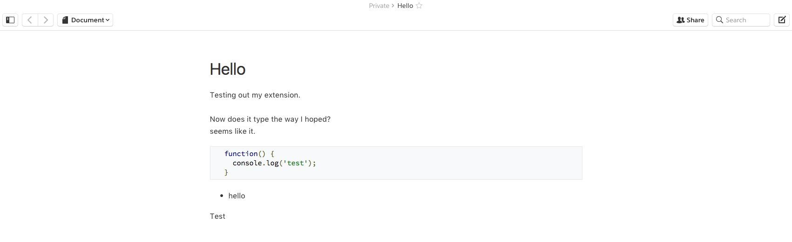

Keep
=========

A Chrome browser extension for custom quip ui

- less intense typography
- toggle's sidebar close on load
- toggle's chat close on load

### Before

### After

## Easy Install

1. Clone the repo to some `~/PATH/`
2. Navigate to `chrome://extensions/` ([extensions](chrome://extensions/))
3. Check `Developer Mode` checkbox in the upper right if not already
4. Click `Load unpacked extensions...`
5. Select `~/PATH/keep`
6. Write the next great American novel
